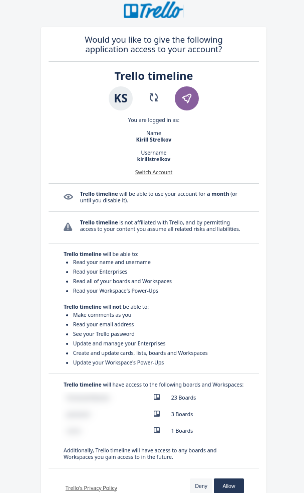

# Trello timeline

Single page app that adds all Trello cards from a single board to the timeline.

Trello timeline on GitHub Pages - https://kirillstrelkov.github.io/trello-timeline/

## Requirements

### Trello access

Read access to Trello is needed to get boards and cards.

When you click `Get Trello boards` you will be redirected to Trello authorization page:

### Card requirements

- Card should have both **start** and **end dates** set
- _optional_ Use [Trello Custom Fields Power-Up](https://trello.com/power-ups/56d5e249a98895a9797bebb9/custom-fields) to set progress
  - Create new field `progress` with `number` as type to your board 

## Mappings between Trello card and timeline card

